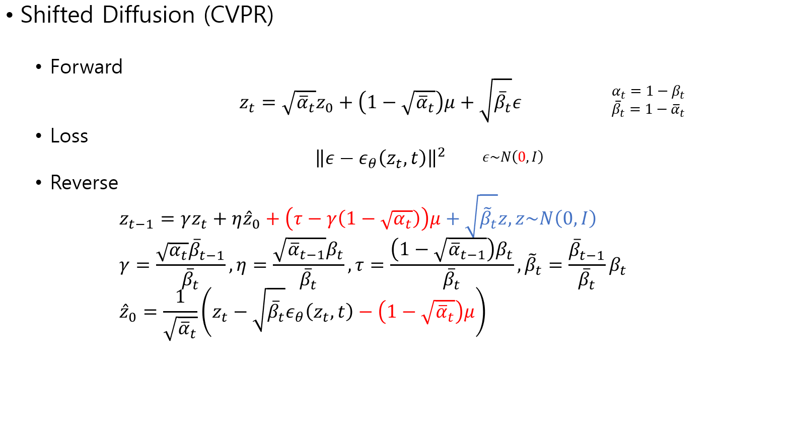
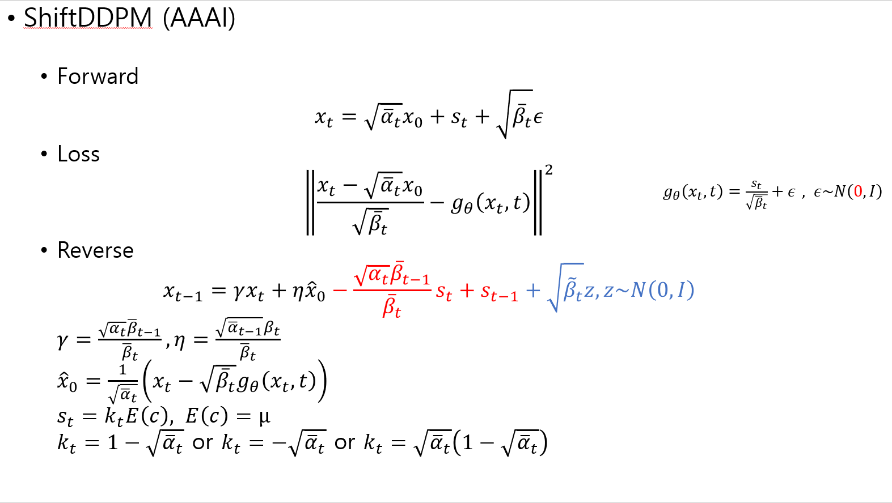
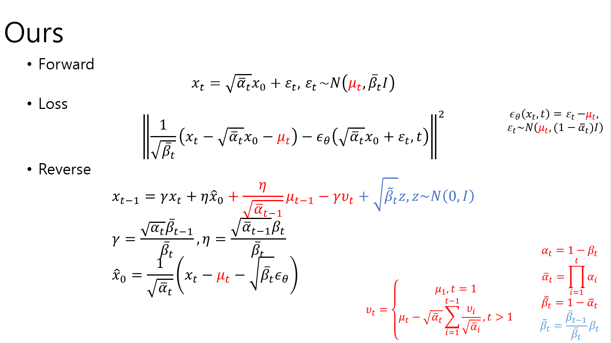
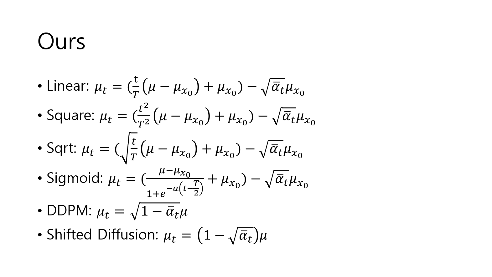
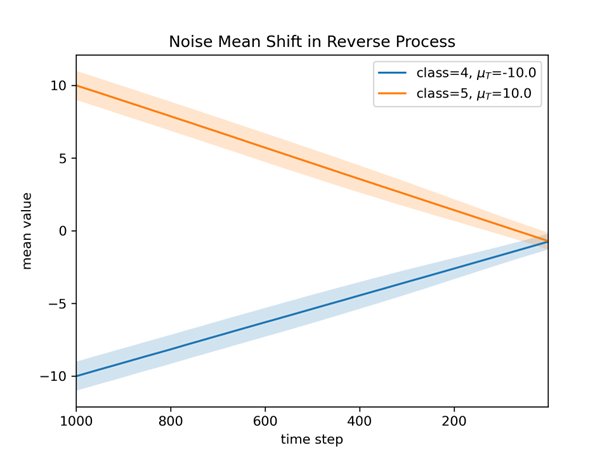
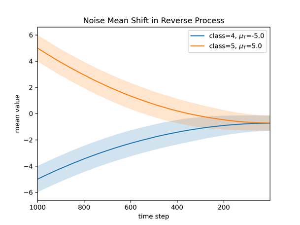
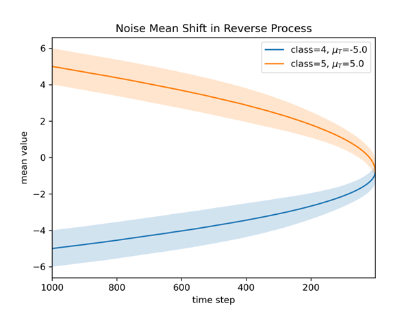
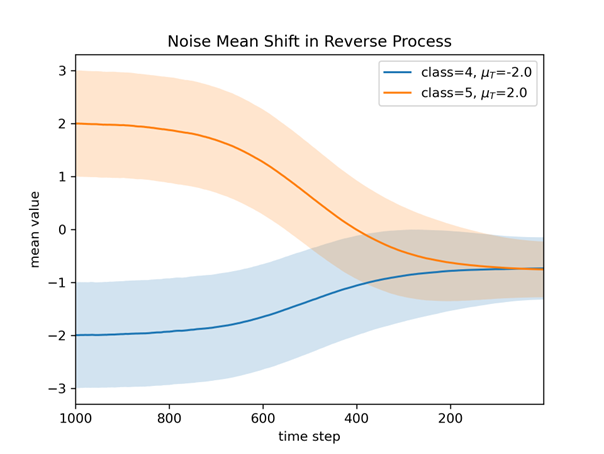
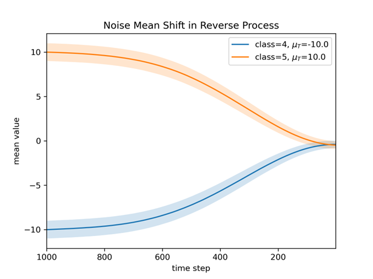

## Seperated DDPM

A pytorch implementation of Seperated DDPM.

The codes are based on Huggingface diffusers from https://github.com/huggingface/diffusers.git

Author: Da Eun Lee

## Method

  

  

  

  

## Experiments

Trajectories of mean values of noisy images following time steps in reverse process.

1. Linear

  

2. Sqaure

  

3. Sqaure root

  

4. Sigmoid

  

5. Shifted Diffusion 

  

## References

PRDC codes are cited by the paper "https://proceedings.mlr.press/v119/naeem20a/naeem20a.pdf"

Related Works
DDPM: "https://proceedings.neurips.cc/paper/2020/file/4c5bcfec8584af0d967f1ab10179ca4b-Paper.pdf"
PriorGrad: "https://arxiv.org/pdf/2106.06406"
Shifted Diffusion: "https://openaccess.thecvf.com/content/CVPR2023/papers/Zhou_Shifted_Diffusion_for_Text-to-Image_Generation_CVPR_2023_paper.pdf"
ShiftDDPMs: "https://ojs.aaai.org/index.php/AAAI/article/download/25465/25237"

